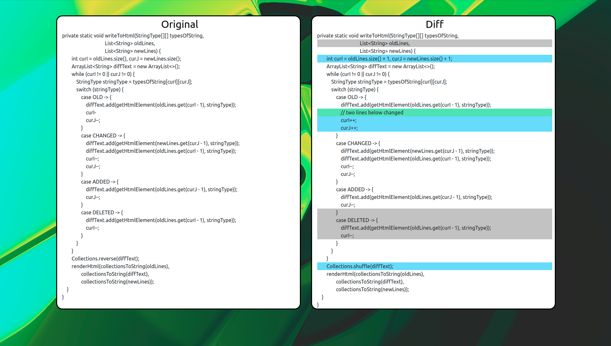
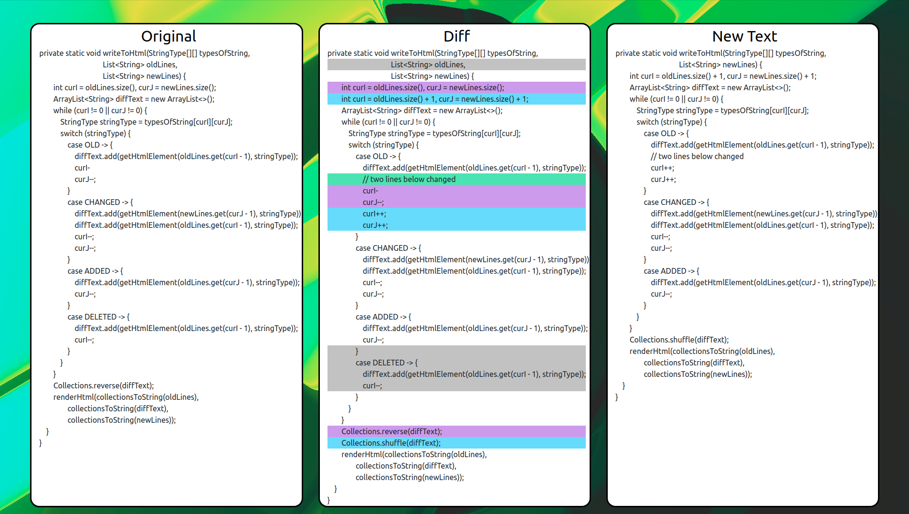

# Тестовое задание для стажировки в "Улучшение поддержки Jupyter ноутбуков в PyCharm"

## Diff

Написать приложение на `Java` или `Kotlin`, которое будет **построчно** сравнивать два текста.

На вход приложение получает пути до двух файлов. В качестве результата работы приложение создает
файл `diff.html`. В котором результат сравнения отображается следующим образом:

* `split view` - слева первый файл, справа второй
* добавленная строка — *зеленый* фон
* удаленная строка — *серый* фон
* измененная строка — *синий* фон

## [Реализация](src/main/java/Diff.java)

### Описание реализации

Решение основано на алгоритме **поиска наибольшей подпоследовательности**, используя **динамическое
программирование**. Строятся таблицы динамики и типов переходов. \
С помощью последней, строки окрашиваются в нужный цвет.

**Frontend** сделан с помощью шаблонов **Freemarker**. \
Есть 2 типа отображения. Изменяются флажком в `Diff.java` :

* `Split view` - Старый файл, Результат сравнения, как описано выше в условии
* `Triple view` - Старый файл, **Расширенный** результат сравнения (*показываются еще и старые
  версии измененных строк*), Новый файл

**Написана документация JavaDoc**

### Работа программы

* Данные из файлов считываются **полностью**, из-за особенностей работы алгоритма.
* Насчитывается таблица динамика и таблица типов переходов, указывающая изменена, удалена, добавлена
  или не изменена строка в новом файле.
* Восстанавливается ответ: идём с последней ячейки таблицы, переходы делаются в зависимости от типа.
  Так, пока не дойдем до начала.
* Ответ предоставляет из себя `List<StringWithType>`, где `StringWithType` - обертка, хранящая в
  себе строку и её тип.
* Строчки входных файлов тоже оборачиваются с дефолтным типом строки.
* Полученные три или два(в зависимости от режима отображения) массива данных отдаются на рендер
  шаблону `Freemarker`.
* В шаблоне рендерится сама страничка и вписываются строки. Строки представляют собой `
`
  блоки с определенным классом, указывающим на тип строки.