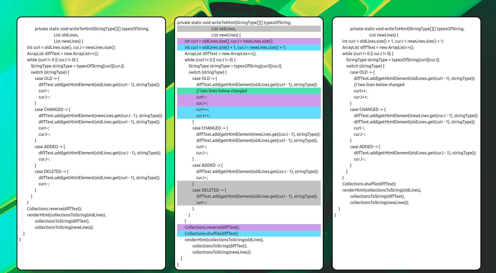

# Тестовое задание для стажировки в "Улучшение поддержки Jupyter ноутбуков в PyCharm"

## Diff
Написать приложение на Java или Kotlin, которое будет **построчно** сравнивать два текста.

На вход приложение получает пути до двух файлов. 
В качестве результата работы приложение создает файл diff.html.
В котором результат сравнения отображается следующим образом:

* split view - слева первый файл, справа второй
* добавленная строка — зеленый фон
* удаленная строка — серый фон
* измененная строка — синий фон

## [Реализация](src/main/java/Diff.java)

Решение основано на алгоритме поиска наибольшей подпоследовательности, используя динамическое 
программирование. 

Данные на вход файлы считываются полностью, из-за особенностей работы алгоритма. 